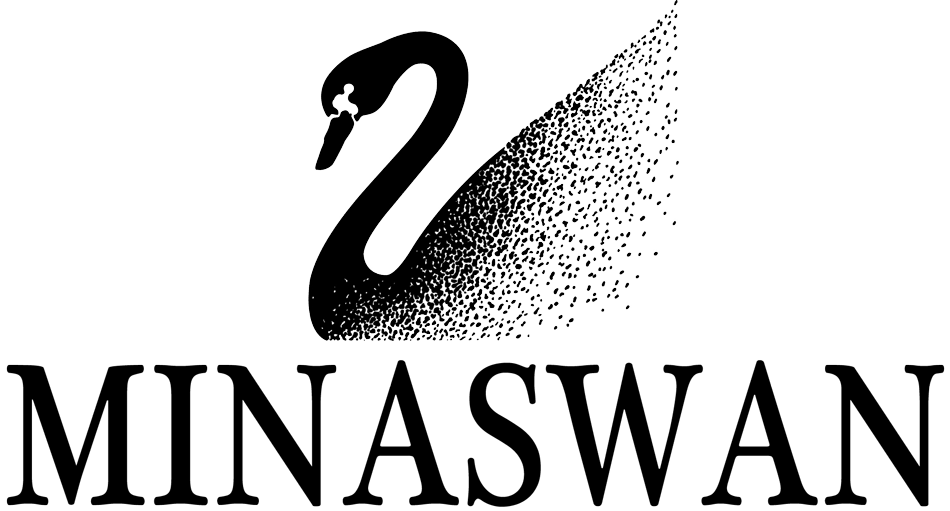

!SLIDE bullets
# Goals

 * \#1 Be Nice
 * \#2 Reading is Fun
 * \#3 Build Stuff

!SLIDE bullets
# Important Goals

 * \#1 Be Nice
 * \#2 Reading is Fun
 * &nbsp;

!SLIDE bullets incremental

# MINASWAN
* __M__atz __I__s __N__ice __A__nd __S__o __W__e __A__re __N__ice
* This effects how you build a gem

!SLIDE center

!SLIDE bullets

# Reading RubyGems
 * But you don't have to take my word for it

!SLIDE bullets

# Build It
 * Don't think, do
 * Experiment and Play
