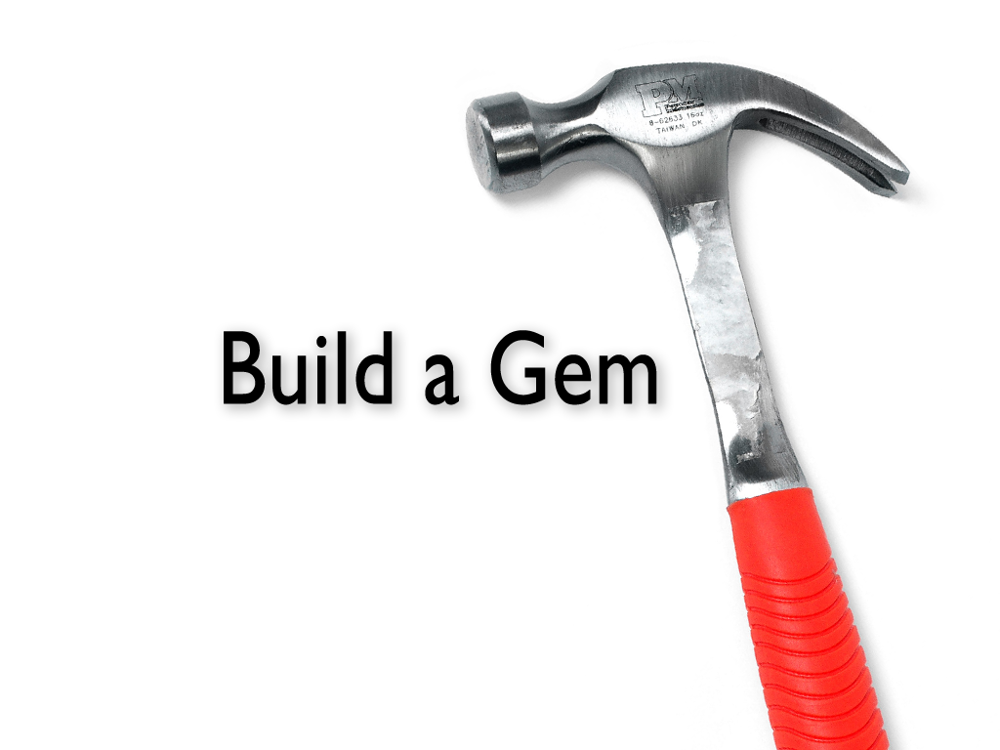

!SLIDE center

!SLIDE

## "when you don't create things, you become defined by your tastes rather than ability. your tastes only narrow & exclude people. so create."
## — Why The Lucky Stiff

.notes ## "Do, or do not. There is no try." —Yoda
.notes Do not fear mistakes. You will know failure. Continue to reach out. - Benjamin Franklin

!SLIDE bullets incremental

# Tools

 * `mkdir lib && vim my_gem.gemspec`

 * newgem

 * hoe

 * ore

 * jeweler

 * bundler

