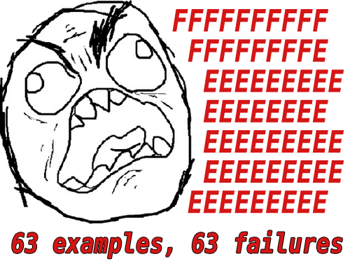

!SLIDE bullets incremental

# MINASWAN
* __M__atz __I__s __N__ice __A__nd __S__o __W__e __A__re __N__ice
* This effects how you build a gem

!SLIDE center

!SLIDE bullets
# Version Numbers

 * _X.Y.Z_

 * &nbsp;

 * &nbsp;

 * &nbsp;

!SLIDE bullets
# Version Numbers

 * Build Number (x.y.__Z__) - Every release

 * Minor (x.__Y__.z) - Backwards Compatible

 * Major (__X__.y.z) - Incompatible

 * Prerelease (x.y.z__beta2__) - Letters in the number?

!SLIDE bullets incremental
# Version Numbers

 * What you need

 * And no more

 * `=  3.0`

 * `~> 3.0`

 * `~> 2.1.0`

 * `>= 3.0`

.notes Let’s say you’re depending on the fnord gem version 2.y.z. If you specify your dependency as ">= 2.0.0" then, you’re good, right? What happens if fnord 3.0 comes out and it isn’t backwards compatible with 2.y.z? Your stuff will break as a result of using ">=". The better route is to specify your dependency with a "spermy" version specifier.

!SLIDE center

# BUNDLE UPDATE

# NOTHING WORKS

!SLIDE

.filename Tom Preston-Werner's
# Semantic Versioning
## http://semver.org/

!SLIDE center

!SLIDE

.filename Eric Hodel says...

# use\_under\_scores

### Matches format of `require "gem_name"`

.notes under\_strike, low\_line, low\_dash, under\_ tie, under\_bar, lazy\_hyphen, horizontal\_bar

!SLIDE

.filename Dr. Brain says...

# Use dashes-for-extensions

### Extending another gem or adding namespace

.notes Github made this the De facto namespace. But it works well.

!SLIDE

.filename He is both a doctor and a brain...

# NO UPPER CASE

### Inside voices please

!SLIDE

# Don't `require 'rubygems'`

.notes not the only packaging manager
.notes dont force your choices on those who want to use your library -- they may not be able to

!SLIDE

## "When you require 'rubygems' in your code, you remove my ability to make that decision. I cannot unrequire rubygems, but you can not require it in the first place."
## — Ryan Tomayko

!SLIDE center

!SLIDE

# Directory Structure

          my_gem/
          ┣ my_gem.gemspec
          ┗ lib/
            ┗ my_gem.rb

.notes lib is added to the load path

!SLIDE bullets incremental

# About that there loadpath

 * Array of directories
 * That can act like a namespace, so...
 * `require "my_gem/factory"` will load...
 * `lib/my_gem/factory.rb`

.notes put our code in lib/my_gem/base and libe/my_gem.rb would just require it.
.notes Files in `lib/` are in the load path, so nest everything except GEMNAME.rb under that. Gives us a namespace.

!SLIDE
# There can be only one

          my_gem/
          ┣ my_gem.gemspec
          ┗ lib/
            ┣ my_gem.rb
            ┗ my_gem/
              ┣ version.rb
              ┣ other.rb
              ┗ files.rb

!SLIDE bullets incremental

# Yay Namespaces!

 * `require 'my_gem'`
 * `gem install 'my_gem'`
 * `module MyGem`

